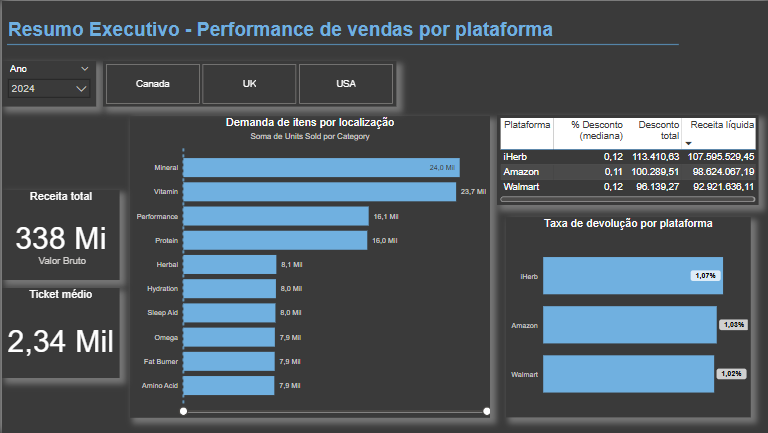
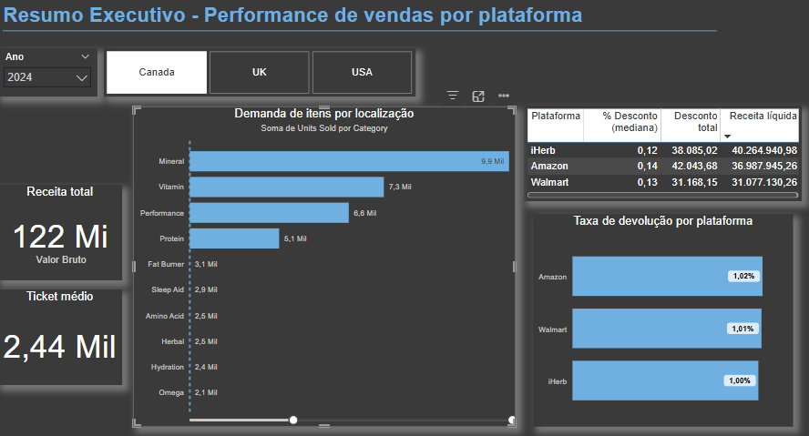
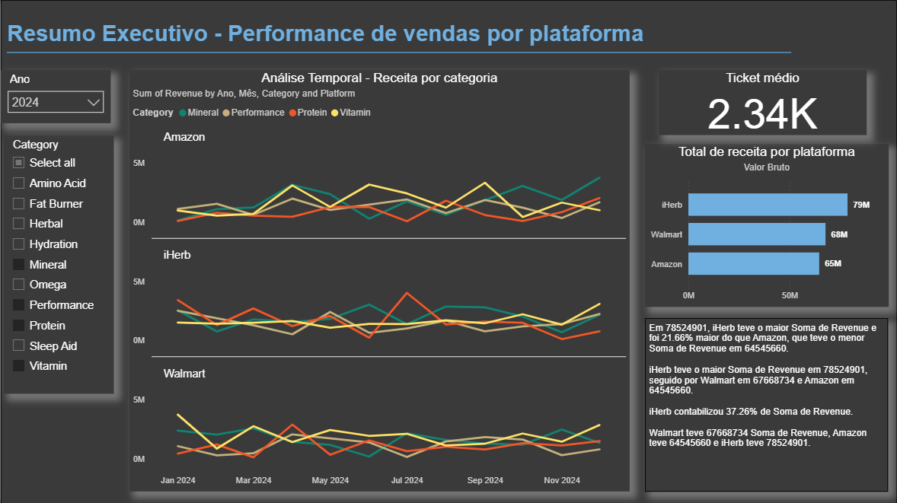

# 📊 Performance de Vendas - Análise Estratégica

## 📊 Visualizações
  
[]
[]
[]

## | Objetivo
Identificar oportunidades de expansão através da análise de:
- Plataformas de vendas com melhor desempenho
- Categorias mais demandadas
- Localizações geográficas mais promissoras
- Taxas de retorno financeiro

## | Perguntas Negócio

### 📦 Estratégia de Produto
- Quais categorias têm maior demanda por região?
- Como varia o ticket médio entre categorias?

### ⚙️ Eficiência Operacional
- Quais plataformas oferecem melhor relação vendas/margem?
- Qual impacto das devoluções na rentabilidade?

### 📈 Tendências de Mercado
- Quais mudanças no comportamento do consumidor?
- Quais categorias emergentes merecem atenção?

## | Insights Principais

### Top Categorias (78% do volume)
| Categoria     | Volume     | Ticket Médio* |
|---------------|------------|---------------|
| Mineral       | 24.0M      | 2.34K         |
| Vitamin       | 23.7M      | 2.24K         |
| Performance   | 16.1M      | 2.35K         |
| Protein       | 16.0M      | 2.34K         |
*Ano base 2024

### Desempenho Geográfico
1. **Canadá**: Maior volume (2024)
2. **USA**: Maior crescimento (Fat Burner +387% YoY, até abril de 2025)
3. **UK**: Mercado estável

### Performance por Plataforma (2024)
| Plataforma | Receita Líquida | % Desconto | Devolução |
|------------|-----------------|------------|-----------|
| iHerb      | 107.5B          | 12%        | 1.07%     |
| Amazon     | 98.6B           | 11%        | 1.03%     |
| Walmart    | 92.9B           | 12%        | 1.02%     |

> **Mudança 2025**: iHerb lidera em devoluções (1.12% vs 0.97% em 2024)

## | Recomendações

### Expansão de Mercado
- **Foco Imediato**: Canadá (maior demanda entre as três localidades)
- **Oportunidade**: USA (Fat Burner + Sleep Aid)
- **Manutenção**: UK

### Mix de Produtos
- **Priorizar**: Top 4 categorias
- **Alocar 15-20%**: Fat Burner (USA)
- **Monitorar**: Sleep Aid/Hydration (Em 2024, nos USA, essas categorias tiveram demandas superior a de Protein )

### Parcerias Plataformas

1. **iHerb** (Líder em receita)  
   ✅ Melhor receita líquida em 2024 (107.5B)  
   ⚠️ Maior taxa de devolução (1.07% → 1.12% em 2025)  
   *Recomendação: Aproveitar volume com políticas anti-devolução*

2. **Walmart** (Excelência operacional)  
   ✅ Menor taxa de devolução desde 2023 (1.02%)  
   🔄 Receita oscilando entre 2º-3º lugar  
   *Oportunidade: Aumentar participação com estratégias de upsell*

3. **Amazon** (Equilíbrio ideal)  
   📈 Taxa de devolução estável (1.03% desde 2023)  
   🥈 Receita consistentemente no top 2  
   *Estratégia: Manter como canal prioritário para novas categorias*

## |Próximos passos

💡 - Série temporal de receita líquida: avaliar por localização para entender e mapear o perfil da demanada, sua sazonalidade e padrões por categoria, desdobrar em estratégias personalizadas de marketing
💡 - Modelo de Machine Learning:previsão de demanda e tomada de decisão estratégica personalizada e eficiente
💡 - Monitorar devolução: entender perfil da evolução das plataformas na tratativa do gargalo de devolução 

## 📂 Dataset Reference

### 🔍 Basic Information
**Title**: Supplement Sales Data  
**Source**: [Kaggle](https://www.kaggle.com/datasets/zahidmughal2343/supplement-sales-data/data)  
**Author**: Zahid Mughal  
**License**: CC0: Public Domain  
**Last Updated**: 2023-11-06